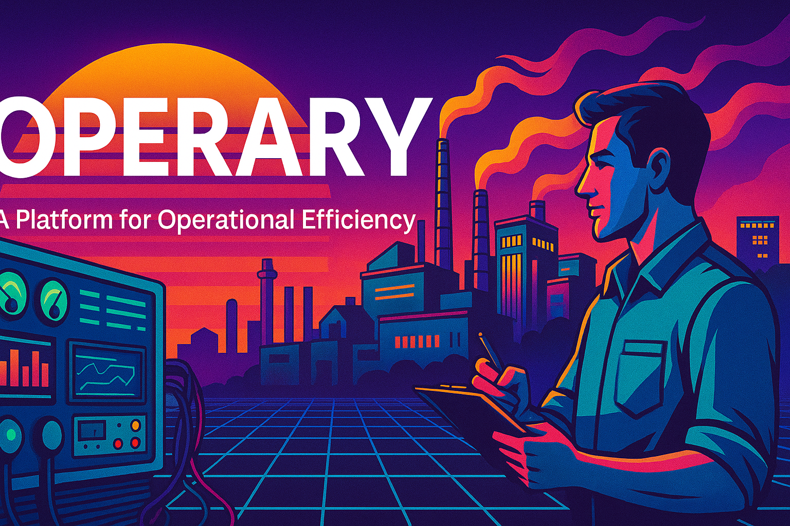

# 🛰️ Operary


> **The coordination engine for industrial operations**  
> Product vision and API-first proof of concept by [Karthik Mohan](https://systemsignal.dev/about)

---

## 🧠 What is Operary?

**Operary** is a fictional(personal project now) yet fully detailed enterprise SaaS platform designed to coordinate **human workflows, machine signals, and operations intelligence** in complex environments like:

- Smart factories  
- Utility operations  
- Plant-based industries  
- Field teams at infrastructure scale

This repository demonstrates **the full lifecycle of building an enterprise SaaS product**:

✅ Product Management (PRD, Roadmap, EOL Plan)  
✅ System Architecture & Design Thinking  
✅ API-first Engineering in Golang  
✅ Real code for a working POC  
✅ UX wireframes, workflows, and usage scenarios

---

## 🧱 Project Structure

```txt
product-management/   → All product artifacts across lifecycle  
design/               → Wireframes, workflows, system maps  
api-spec/             → OpenAPI spec file (Golang-first)  
backend/              → Golang server implementation (POC)  
tests/                → Postman collection, test flows  
docs/                 → Architecture, personas, risk notes

All API requests must include an `X-Org-Token` header for access control.

# 💡 Key Use Cases

* Create and assign operational tasks triggered by machine events or human inputs
* Receive external alerts via webhook to auto-create tasks
* Generate end-of-shift reports summarizing completed work
* Coordinate shift-based responsibilities across teams
* Provide real-time dashboards for plant supervisors
* Auto-generate audit logs and traceability trails
* Enable API-based orchestration with SCADA, MES, or ERP systems

---

# 🧰 Built With

* **GoLang** (REST-first backend)
* **PostgreSQL** (internal simulation)
* **OpenAPI v3**
* **Markdown** (for all product collateral)
* **GitHub Pages + Jekyll** (linked portfolio docs)
## Quickstart

1. Install Go 1.18+
2. Start the backend with `go run backend/cmd/operary/main.go`
3. Run `go run scripts/sim_shift_test.go` to simulate a shift


## Module Overview
Operary is organized into small Go packages under `backend/internal`. Each package exposes HTTP handlers, a usecase layer, and a Mongo-backed repository. The main modules are:
- **CorePad** – operator notes
- **OpsMirror** – live system status
- **AuditSync** – digital audit log
- **PermitGrid** – permit-to-work requests
- **EquipTrust** – equipment ledger
- **SensorVault** – machine event storage
- **TrainOps** – self-learning operational intelligence
A full list of functions is provided in [docs/overview.md](docs/overview.md).

---

# 📚 Learn More

This repo is part of the System Signal Portfolio.

Explore other concept systems and strategies at:
🔗 [systemsignal.dev/projects](https://systemsignal.dev/projects)

---

# 📝 Author

Karthik Mohan

AVP – Products

📫 [karthik@systemsignal.dev](mailto:karthik@systemsignal.dev)

🌐 [https://systemsignal.dev](https://systemsignal.dev)

---

# 🔒 License & Use

This project is shared for visibility and portfolio reference only.

All content (code, documents, designs) is © Karthik Mohan and remains proprietary.
🚫 No reuse, reproduction, or distribution is allowed without written permission.

For licensing, collaboration, or demo inquiries: Contact Me
